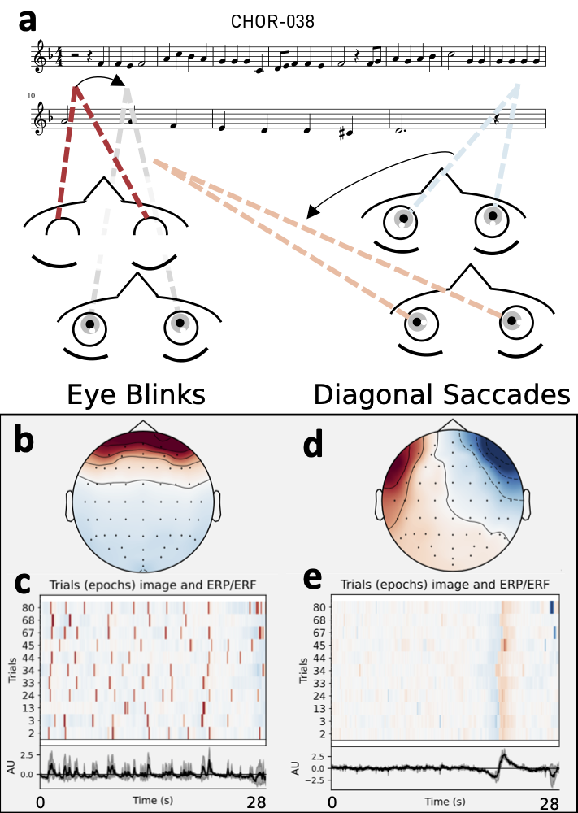
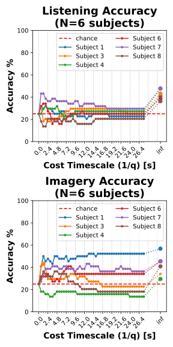

# Code for: EEG Blink Artifacts Can Identify Read Music in Listening and Imagery

Link to paper: [https://doi.org/10.48550/arXiv.2508.13807](https://doi.org/10.48550/arXiv.2508.13807)

    
<figure>

<em>Fig. 1. <b>a</b> One chorale (CHOR-038) from the music imagery dataset [1,2].
<b>b–c</b> Top independent component analysis (ICA) component corresponding to eye blinks for Subject 1, extracted from 11 listening trials with synchronous reading of CHOR-038's sheet music. 
<b>d–e</b> Second ICA component for the same subject, chorale and condition (CHOR-038, listening) showing diagonal saccades (eye sweeps) between the two lines of music, occurring near the end of the first line (expected duration = 9 bars × 2.4s/bar = 21.6s).
</em>
</figure>

Listen to [CHOR-038.wav](https://drive.google.com/file/d/1fVBrPdgQDu1J46OhiqiSHlXk-VOn8bHu/view?usp=drive_link) | remaining stimuli: [drive](https://drive.google.com/drive/folders/1VdsNiXKG1EHzkwo7qfuvNIP174QilhGl?usp=drive_link) | [Score.pdf](1-source-data/datasetCND_musicImagery/stimuli/midi/Score.pdf)

# Overview
This repo documents the steps needed to reproduce classification results for mapping eye-blinks during music reading to the piece of music being read.
Our motivation is to explore whether eye blinks, given their relatively high amplitudes and ease of recording (compared to EEG activity from cortical sources), can still be useful -- especially in wearable contexts where actual EEG may be hard to capture.

We use a public EEG dataset [1, 2] of professional musicians listening to or imagining music, synchronously with reading from a [score](1-source-data/datasetCND_musicImagery/stimuli/midi/Score.pdf).
More information and decoding results using EEG are available in the publications associated with this dataset [3-5].

Here, we use the CND version of the dataset, and import it into EEGLAB [6] and MNE-Python [7] for exploratory analysis and blink identification. Two toolboxes are used here just for the ease of running ICA [8] and ICLabel [9] within [EEGLAB](https://github.com/sccn/eeglab), followed by BLINKER [10] for extracting blinks from eye-related ICs. MNE-related code is supplied just for the ease of using Jupyter notebooks and downstream processing with python.

Depending on your preference for working with the source data and your preferred tool (EEGLAB or MNE-Python), you could execute or skip some of the steps below, that go from:
- reading the public dataset (.mat files, as filtered and downsampled by the dataset authors, see [readme.txt](1-source-data/datasetCND_musicImagery/readme.txt)), 
- extracting eye-blinks (or any other features), and 
- using blinks (or your features of choice) for music classification.

Alternatively, you could start with numpy arrays of extracted blinks by subject / condition that we include in this repo. As the dataset doesn't provide a ground truth for verifying extracted blinks, we attempt to manually inspect and accept/reject blink candidates from BLINKER. Still, given the uncertainty and subjective judging of blinks, we limit this preliminary analysis to subjects 1 through 8. The full dataset has N=21 professional musicians (our notebooks are able to load all .mat files into EEGLAB / MNE as needed for extending the analysis).

In our analysis, we first identify blinks for the first 8 subjects in the dataset, and then try to identify which piece of music a subject was reading, separately for the listening or imagery trials (within subject).
We compare blink timings across trials by calculating a neuronal spike-train distance, the Victor-Purpura metric [11], here applied to _blink trains_. 
This method estimates the distance between two blink trains as the cost of converting one blink train (trial) into the other, where cost is associated with adding/removing blinks, and time-shifting the blinks.
We use the Victor-Purpura implementation from Elephant [12].

Of the 8 subjects analyzed for blinking activity, two subjects were dropped as blinks could not be identified for all of their trials.
The remaining 6 subjects showed above chance-level decoding accuracy for identifying which of the four chorales was being read on a given (left-out) trial, by comparing its distance to 43 other trials for the same subject and condition (listening/imagery).
We also swept a cost factor *q* associated with the Victor-Purpura distance, which can be thought of as scaling the cost associated with shifting the blinks (that is, it allows us to control how much to penalize time-shifts, relative to adding/dropping blinks as one blink train is morphed into the other).
We see best accuracies when blinks are free to shift (q=0), that is, when only the total blink counts are considered across different chorales:

    
<figure>

<em>Fig. 2. Intra-subject sight-read music classification accuracies using Victor-Purpura distance between blink times with one-trial left-out cross validation.
Hyperparameter q (cost factor) was swept for each subject, with highest accuracies seen for q = 0Hz (equivalently 1/q= ∞ s), except for Subject 3 in the imagery condition.
</em>
</figure>

Here's a step-by-step breakdown of all the scripts and notebooks in this repo:

# Steps & Outputs

## Environment setup
- Python: see [requirements.txt](./requirements.txt) for the python/MNE setup.
- EEGLAB: see comments in [3-find-blinks/3.1-eeglab-blinker/3.1-eeglab-import-data-mat-run-ica-blinker.m](./3-find-blinks/3.1-eeglab-blinker/3.1-eeglab-import-data-mat-run-ica-blinker.m)

## Downloading the CND dataset (.mat and stimuli files)
- [1-download-dataset.ipynb](./1-source-data/1-download-dataset.ipynb): downloads and unzips the CND dataset [1].
    - Outputs: populates the dataset directory: [1-source-data/datasetCND_musicImagery](./1-source-data/datasetCND_musicImagery/)

## Converting the dataset to numpy arrays and FIFs (MNE-Python)
- [2.1-stim-mat-wav-midi-to-npy.ipynb](./2-mat-to-npy-fif/2.1-stim-mat-wav-midi-to-npy.ipynb): visualized the music stimuli (Bach chorales), reading in the different formats the stimuli are provided as (wav, MIDI, acoustic envelope, and surprisal as estimated with IDyOM).
    - Outputs: parsed stimuli data are saved as npy arrays for each of 4 chorales in [2-mat-to-npy-fif/npy/stim/](./2-mat-to-npy-fif/npy/stim/)
- [2.2-eeg-stim-to-npy-fif.ipynb](./2-mat-to-npy-fif/2.2-eeg-stim-to-npy-fif.ipynb): reads in each subject's .mat data, and exports separte .npy and .fif files for each subject/condition/chorale trial. This results in 21 subjects x 2 conditions x 4 chorales x 11 trials = 1848 files, each a ~28s long trial.
    - Outputs: 
        - npy: [2-mat-to-npy-fif/npy/data/](./2-mat-to-npy-fif/npy/data/) 
        - fif: [2-mat-to-npy-fif/fif/](./2-mat-to-npy-fif/fif/) 

## Extracting blinks from the .mat data using BLINKER, visually inspecting in MNE-Python
- [3.1-eeglab-import-data-mat-run-ica-blinker.m](./3-find-blinks/3.1-eeglab-blinker/3.1-eeglab-import-data-mat-run-ica-blinker.m): read the .mat files into EEGLAB, run ICA, ICLabel, and BLINKER to get blink candidates
    - Outputs: BLINKER results are saved to [3-find-blinks/3.1-eeglab-blinker/blinkerDumpDir](./3-find-blinks/3.1-eeglab-blinker/blinkerDumpDir/)
- [3.2-sub*-inspect-blinks-merge-fif.ipynb](./3-find-blinks/3.2-manually-select-blinker-blinks/): Jupyter notebooks for visually examining and accepting/rejecting BLINKER's blink candidates. Each subject's FIFs are merged in trial order with blink annotations.
    - Outputs: merged FIFs for each subject in trial-order are saved to 
    [3-find-blinks/3.2-manually-select-blinker-blinks/merged-fif/](./3-find-blinks/3.2-manually-select-blinker-blinks/merged-fif/)

## Victor-Purpura distance between paired trials (within subject & condition)
- [4.1-merged-fif-to-victor-purpura-distance-npy.ipynb](./4-blink-train-distance/4.1-merged-fif-to-victor-purpura-distance-npy.ipynb): calculate Victor-Purpura distance on all trial pairs for each subject and condition (listening/imagery)
    - Outputs: Numpy arrays of pairwise Victor-Purpura distances saved to [4-blink-train-distance/npy/](./4-blink-train-distance/npy/)
    - These are committed to the repo, and can be analyzed directly for assessing blink-timing similiarity across subjects-chorales-conditions
- [4.2-leave-one-trial-out-music-classifier.ipynb](./4-blink-train-distance/4.2-leave-one-trial-out-music-classifier.ipynb): leave-one-trial-out cross-validation to indentify the read music on each left-out-trial, within subject and condition. 
    - Outputs: Figures for the paper, saved to [figures/](./figures/)

## Supplemental
- TBD, add figures comparing blink variations across subjects/chorales/conditions

# References
[1] Music listening / imagery dataset from Marion et al. in the CND format, https://cnsp-resources.readthedocs.io/en/latest/datasetsPage.html

[2] Marion, G., Di Liberto, G., & Shamma, S. (2021). Data from: The music of silence. Part I: Responses to musical imagery encode melodic expectations and acoustics (Version 4, p. 1517647013 bytes) [Dataset]. Dryad. https://doi.org/10.5061/DRYAD.DBRV15F0J

[3] Marion, G., Liberto, G. M. D., & Shamma, S. A. (2021). The Music of Silence: Part I: Responses to Musical Imagery Encode Melodic Expectations and Acoustics. Journal of Neuroscience, 41(35), 7435–7448. https://doi.org/10.1523/JNEUROSCI.0183-21.2021

[4] Liberto, G. M. D., Marion, G., & Shamma, S. A. (2021). The Music of Silence: Part II: Music Listening Induces Imagery Responses. Journal of Neuroscience, 41(35), 7449–7460. https://doi.org/10.1523/JNEUROSCI.0184-21.2021

[5] Di Liberto, G. M., Marion, G., & Shamma, S. A. (2021). Accurate Decoding of Imagined and Heard Melodies. Frontiers in Neuroscience, 15. https://www.frontiersin.org/articles/10.3389/fnins.2021.673401

[6] Delorme, A. & Makeig, S. (2004) EEGLAB: an open-source toolbox for analysis of single-trial EEG dynamics, Journal of Neuroscience Methods 134:9-21. [PDF](http://sccn.ucsd.edu/eeglab/download/eeglab_jnm03.pdf).

[7] Gramfort, A., Luessi, M., Larson, R., Engemann, D. A., Strohmeier, D., Brodbeck, C., Goj, R., Jas, M., Brooks, T., Parkkonen, L., & Hämäläinen, M. S. (2013). MEG and EEG data analysis with MNE-Python. Frontiers in Neuroscience, 7(267):1–13, [doi:10.3389/fnins.2013.00267](https://doi.org/10.3389/fnins.2013.00267).

[8] Makeig, S., Bell, A. J., Jung, T-P., & Sejnowski, T. J. (1996). Independent component analysis of electroencephalographic data, In: D. Touretzky, M. Mozer and M. Hasselmo (Eds). Advances in Neural Information Processing Systems 8:145-151, MIT Press, Cambridge, MA. [PDF](https://sccn.ucsd.edu/~scott/pdf/ICA_NIPS96.pdf).

[9] Pion-Tonachini, L., Kreutz-Delgado, K., Makeig, S. (2019) ICLabel: An automated electroencephalographic independent component classifier, dataset, and website. NeuroImage 198:181-197. [PDF](https://pubmed.ncbi.nlm.nih.gov/31103784/).

[10] Kleifges, K., Bigdely-Shamlo, N., Kerick, S. E., & Robbins, K. A. (2017). BLINKER: Automated Extraction of Ocular Indices from EEG Enabling Large-Scale Analysis. Frontiers in Neuroscience, 11. https://www.frontiersin.org/articles/10.3389/fnins.2017.00012

[11] Victor, J. D., & Purpura, K. P. (1997). Metric-space analysis of spike trains: Theory, algorithms and application. Network: Computation in Neural Systems, 8(2), 127–164. https://doi.org/10.1088/0954-898X_8_2_003

[12] Denker, M., Yegenoglu, A., & Grün, S. (2018). Collaborative HPC-enabled workflows on the HBP Collaboratory using the Elephant framework. Neuroinformatics 2018, P19. doi:10.12751/incf.ni2018.0019
